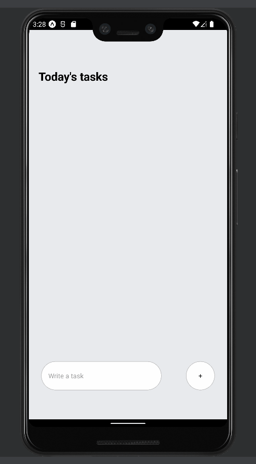

# To-Do List with React Native

## Description

I created a simple to do app using the react native library for practice with react native.

## Starting the Application

This application was ran on the Expo open source platform through an Android emulator provided by the Android Studio. To run the application using Expo, please follow the ['getting started'](https://docs.expo.dev/get-started/installation/) guide on the Expo website, and install an emulator of your choice. I used an emulator provided by [Android Studio](https://developer.android.com/studio).

Note that you may run the application using Expo in your browser, but this application was designed specifically for mobile usage.

## Usage

When the application is open, there is a simple UI that allows users to enter in tasks which will populate the list above. Clicking on the tasks will remove them from the list.

## Credits

This applicaiton was built using the tutorial provided by [Made with Matt](https://www.youtube.com/c/MadeWithMatt).
